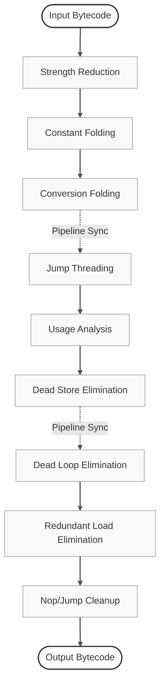

```mermaid
graph TD
    %% Main Entry
    A([Input Bytecode]) --> B[Strength Reduction]
    B --> C[Constant Folding]
    C --> D[Conversion Folding]
    
    %% Junction untuk pindah baris agar tidak memanjang kesamping
    D -.-> |Pipeline Sync| E[Jump Threading]
    
    E --> F[Usage Analysis]
    F --> G[Dead Store Elimination]
    
    %% Junction kedua
    G -.-> |Pipeline Sync| H[Dead Loop Elimination]
    
    H --> I[Redundant Load Elimination]
    I --> J[Nop/Jump Cleanup]
    J --> K([Output Bytecode])

    %% Corporate Style
    style A fill:#ffffff,stroke:#333333,stroke-width:2px
    style K fill:#ffffff,stroke:#333333,stroke-width:2px
    style B fill:#f9f9f9,stroke:#999999
    style C fill:#f9f9f9,stroke:#999999
    style D fill:#f9f9f9,stroke:#999999
    style E fill:#f9f9f9,stroke:#999999
    style F fill:#f9f9f9,stroke:#999999
    style G fill:#f9f9f9,stroke:#999999
    style H fill:#f9f9f9,stroke:#999999
    style I fill:#f9f9f9,stroke:#999999
    style J fill:#f9f9f9,stroke:#999999
    
    linkStyle default stroke:#555555,stroke-width:2px

```